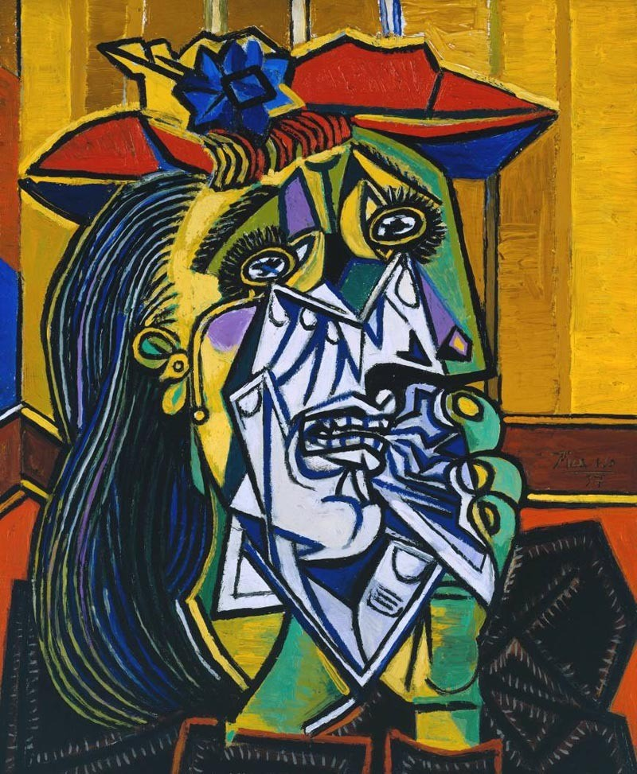
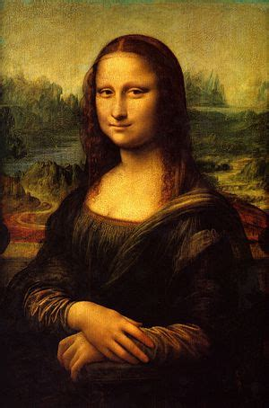

# Neural Style Transfer

## About

This project aims to explore the domain of **Neural Style Transfer** by recreating the work of [Gatys et al., 2015](https://arxiv.org/abs/1508.06576)

### WIP

Creating a neural network to convert the style of an image to a pre-defined style based on the work of [Johnson et al., 2016](https://arxiv.org/abs/1603.08155)

## Collaborators

[Alex Prateek Shankar](https://github.com/alex-ele-xela)

[Sneh Shah](https://github.com/sneh2909)

## What is Neural Style Transfer

A method used in artificial intelligence and computer vision called neural style transfer (NST) enables the creative style of one image—referred to as the "style image"—to be transferred to another—referred to as the "content image." The outcome is a brand-new image that blends the style and content of the content image.

Neural style transfer involves keeping the high-level content of the content image while utilizing a neural network to repeatedly change the pixels of the content image to fit the style of the style image. The network is typically pretrained on a large dataset for image recognition tasks, such as the VGG network.

## Examples

The following images are generated using the Style Transfer optimization, with *Content Weight set to 1e5* and *Style Weight set to 1e4*. All are generated using *LBFGS optimizer* and correspond to the *500th iteration* of the optimization process

Content Image | Style Image | Generated Image
---|---|---
||
||
||
||
||
||
||

### How to access all examples

- The content images are available at **data/content_images**
- The style images are available at **data/style_images**
- All the generated examples along with logs and video are available at **data/output_images/optimization/\<content image> styled as \<style image>/\<content weight> \<style weight> \<tv weight>/**

#### For example:
Tubingen styled as Van Gogh Starry Night
- Content Image: [data/content_images/tubingen.png](./data/content_images/tubingen.png)
- Style Image: [data/style_images/vg_starry_night.jpg](./data/style_images/vg_starry_night.jpg)
- Outputs: [data/output_images/optimization/tubingen styled as vg_starry_night/100000 10000 1](./data/output_images/optimization/tubingen%20styled%20as%20vg_starry_night/100000%2010000%201)
- Log file: [data/output_images/optimization/tubingen styled as vg_starry_night/100000 10000 1/log.txt](./data/output_images/optimization/tubingen%20styled%20as%20vg_starry_night/100000%2010000%201/log.txt)
- Video: [data/output_images/optimization/tubingen styled as vg_starry_night/100000 10000 1/out.mp4](./data/output_images/optimization/tubingen%20styled%20as%20vg_starry_night/100000%2010000%201/out.mp4)